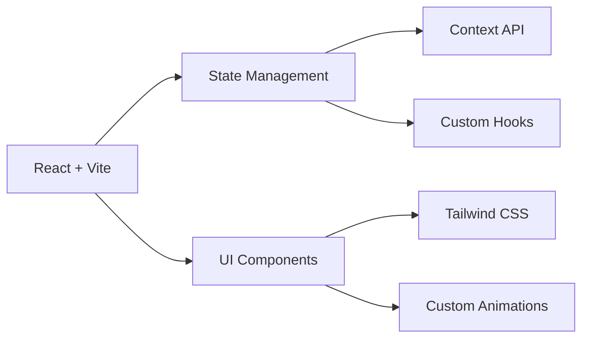

# � ChitChat

<div align="center">
  
  
  <h1>ChitChat</h1>
  <p><em>Next-Gen Chat App for the Modern World</em></p>

  [ for details.

### 🌟 How to Contribute

1. **Fork & Clone**
   ```bash
   # Fork via GitHub UI
   git clone https://github.com/YOUR_USERNAME/Real-time-chat.git
   ```

2. **Setup Development Environment**
   ```bash
   cd Real-time-chat
   npm run setup
   npm run dev
   ```

3. **Create Feature Branch**
   ```bash
   git checkout -b feature/AmazingFeature
   ```

4. **Make Changes & Test**
   ```bash
   # Run tests
   npm test
   
   # Run linting
   npm run lint
   ```

5. **Commit & Push**
   ```bash
   git commit -m "✨ Add amazing feature"
   git push origin feature/AmazingFeature
   ```

6. **Open Pull Request**
   - Use our PR template
   - Reference related issues
   - Include screenshots/GIFs
   - Explain your changes

### 🎯 Contribution Ideas
- 📱 Mobile Responsiveness
- 🎨 UI/UX Improvements
- 🔒 Security Enhancements
- 🚀 Performance Optimizations
- 📖 Documentation
- 🌐 Internationalizations](https://github.com/1DeepanshuPathak1/Real-time-chat/actions/workflows/deploy.yml/badge.svg)](https://github.com/1DeepanshuPathak1/Real-time-chat/actions/workflows/deploy.yml)
  [](https://github.com/1DeepanshuPathak1/Real-time-chat/stargazers)
  [](https://github.com/1DeepanshuPathak1/Real-time-chat/network/members)
  [](https://github.com/1DeepanshuPathak1/Real-time-chat/issues)
  [](https://github.com/1DeepanshuPathak1/Real-time-chat/blob/main/LICENSE)
  
  <br />
  
  
  
  
  
  
  
</div>

## 🔥 Why ChitChat?

ChitChat isn't just another chat app – it's a next-generation communication platform built for how people connect today. Whether you're sharing memes with friends, collaborating with teammates, or building your community, ChitChat makes it seamless and fun.

### ⚡️ Killer Features

#### 🚀 Core Experience
- **Instant Messaging on Steroids**
  - Real-time message delivery (< 100ms latency)
  - Smart typing indicators
  - Read receipts
  - Message reactions with emojis
  - Message threading & replies
  - Message editing & deletion

#### 📸 Rich Media Sharing
- **Camera Integration**
  - Direct camera access
  - Image filters & effects
  - Quick capture & share
  - High-quality compression
  
- **File Sharing**
  - Drag & drop support
  - Preview before sending
  - Multiple file types supported
  - Automatic file optimization

#### 🎮 Interactive Features
- **Polls & Surveys**
  - Quick poll creation
  - Multiple choice options
  - Real-time results
  - Poll analytics
  
- **Emoji & Reactions**
  - Modern emoji picker
  - Quick reactions
  - Custom emoji support
  - Reaction animations

#### 🎨 Personalization
- **Theme Engine**
  - Dark/Light modes
  - Custom color schemes
  - Modern UI elements
  - Smooth transitions
  
- **Custom Settings**
  - Notification preferences
  - Privacy controls
  - Sound settings
  - Interface customization

### 🔒 Security & Authentication
- **Firebase Authentication** - Secure user authentication
- **Real-time Presence** - See who's online
- **End-to-end Message Persistence** - Never lose your chat history

### 🎨 User Experience
- **Responsive Design** - Works seamlessly on desktop and mobile
- **Camera Integration** - Take and share photos directly
- **File Sharing** - Support for multiple file types
- **Contact Management** - Easy friend requests and contact organization

## 🛠️ Tech Architecture

### 🎨 Frontend Excellence


### ⚡ Core Technologies
- **Frontend Magic**
  - 🔧 React 18 with Vite
  - 🎨 Tailwind CSS
  - 🔄 Custom Hooks
  - 🌐 Socket.IO Client
  - 🔥 Firebase SDK
  - 📱 Responsive Design

- **Backend Power**
  - 🚀 Node.js + Express
  - 🔌 Socket.IO Server
  - 🔑 Firebase Admin
  - 🔒 JWT Authentication
  - 📡 WebSocket Protocol

- **Database & Storage**
  - 🗄️ Firebase Firestore
  - 📦 Firebase Storage
  - 🔄 Real-time Sync
  - 📊 Data Indexing

### 💫 Performance Features
- **Optimizations**
  - Lazy Loading
  - Code Splitting
  - Image Optimization
  - Caching Strategies
  - Service Workers

- **Security Measures**
  - End-to-end Message Encryption
  - Secure File Transfer
  - Rate Limiting
  - Input Sanitization

## 🚀 Getting Started

### Prerequisites
```bash
Node.js >= 14.0.0
npm >= 6.14.0
Git
Firebase Account
```

### 🔧 Development Setup

1. Clone the repository:
   ```bash
   git clone https://github.com/1DeepanshuPathak1/Real-time-chat.git
   cd Real-time-chat
   ```

2. Install dependencies:
   ```bash
   # Install client dependencies
   cd client
   npm install

   # Install server dependencies
   cd ../server
   npm install
   ```

3. Set up environment variables:
   ```bash
   # In client directory
   cp .env.example .env
   # Add your Firebase config

   # In server directory
   cp .env.example .env
   # Add your server config
   ```

4. Start the development servers:
   ```bash
   # Start client (in client directory)
   npm run dev

   # Start server (in server directory)
   npm run dev
   ```

## 📱 Features in Detail

### Real-time Messaging
- Instant message delivery
- Message status indicators
- Typing indicators
- Read receipts
- Message history persistence

### Media Sharing
- Image sharing with preview
- Document sharing with type detection
- Camera capture integration
- File size optimization

### User Experience
- Customizable themes
- Responsive design
- Intuitive interface
- Smooth animations
- Error handling with user feedback

### Security
- Firebase Authentication
- Firestore security rules
- Input sanitization
- File type validation
- Rate limiting

## 🤝 Contributing

Contributions are welcome! Please feel free to submit a Pull Request. For major changes, please open an issue first to discuss what you would like to change.

1. Fork the Project
2. Create your Feature Branch (\`git checkout -b feature/AmazingFeature\`)
3. Commit your Changes (\`git commit -m 'Add some AmazingFeature'\`)
4. Push to the Branch (\`git push origin feature/AmazingFeature\`)
5. Open a Pull Request

## 📝 License

This project is licensed under the MIT License - see the [LICENSE](LICENSE) file for details.

## 🙏 Acknowledgments

- [Firebase](https://firebase.google.com/) for the amazing backend services
- [Socket.IO](https://socket.io/) for real-time capabilities
- [React](https://reactjs.org/) for the frontend framework
- All the contributors who have helped improve ChitChat

---

<div align="center">
  Made with ❤️ by <a href="https://github.com/1DeepanshuPathak1">Deepanshu Pathak</a>
</div>
